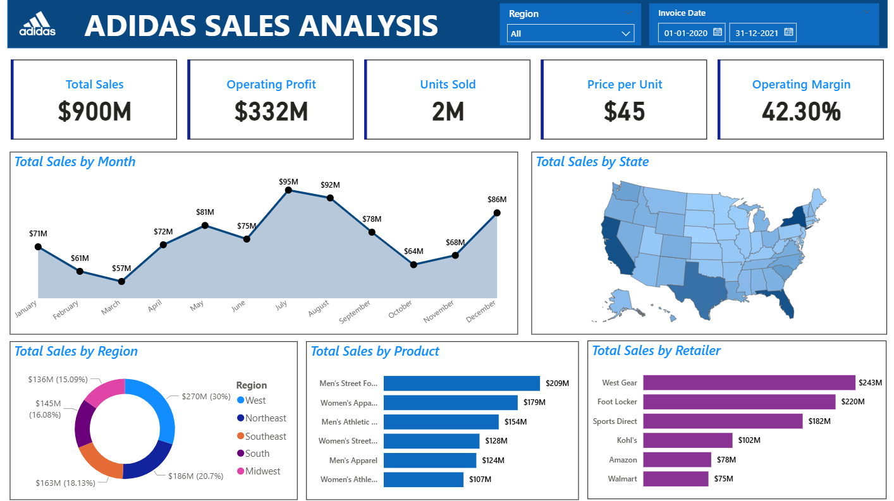

# 📊 Adidas Sales Analysis - Power BI Dashboard  

An interactive **Power BI Dashboard** that provides a comprehensive analysis of Adidas sales data.  
The project focuses on uncovering insights from **sales, profit, products, retailers, and regional performance** to support data-driven decision-making.  

---

## 📌 Table of Contents  
- [Overview](#overview)  
- [Key Insights](#key-insights)  
- [Dashboard Features](#dashboard-features)  
- [Tools & Skills Used](#tools--skills-used)  
- [Dashboard Preview](#dashboard-preview)  
- [How to Use](#how-to-use)  
- [Future Scope](#future-scope)  
- [Author](#author)  

---

## 📖 Overview  
This project showcases the use of **Power BI** for business intelligence and sales analytics.  
The Adidas dataset is analyzed to monitor **KPIs, trends, and comparisons** across time, geography, products, and retailers.  

---

## 🔑 Key Insights  
- **Total Sales:** $900M  
- **Operating Profit:** $332M  
- **Units Sold:** 2M  
- **Operating Margin:** 42.3%  
- **Peak Month:** July ($95M)  
- **Top Region:** West ($270M)  
- **Top Retailer:** West Gear ($243M)  

---

## 🖥 Dashboard Features  
- **Monthly Sales Trends** – Identify seasonal peaks and dips.  
- **Regional & State Analysis** – Compare sales contribution by geography.  
- **Product-Wise Breakdown** – Insights into footwear and apparel categories.  
- **Retailer Performance** – Evaluate sales across major retailers like West Gear, Foot Locker, and Sports Direct.  
- **Dynamic Interactivity** – Filters and slicers powered by DAX for real-time exploration.  

---

## 🛠 Tools & Skills Used  
- **Power BI Desktop**  
- **DAX (Data Analysis Expressions)**  
- **Data Modeling**  
- **Data Visualization & Storytelling**  

---

## 📷 Dashboard Preview  
  

---

## 🚀 How to Use  
1. Clone this repository.  
2. Open the `.pbix` file in **Power BI Desktop**.  
3. Use filters and slicers to explore the dashboard interactively.  

---

## 🔮 Future Scope  
- Integration with **real-time sales data**.  
- Adding **predictive analytics** for forecasting sales.  
- Automated **Power BI service deployment** for stakeholders.  

---

## 👤 Author  
**Utsav Kumar**  
- 💼 Aspiring Data Analyst | Power BI Enthusiast  
- 🔗 [LinkedIn Profile](https://www.linkedin.com/in/utsav-kumar-11779a25a)  
- 📧 utsavkumar2112003@gmail.com  

---
